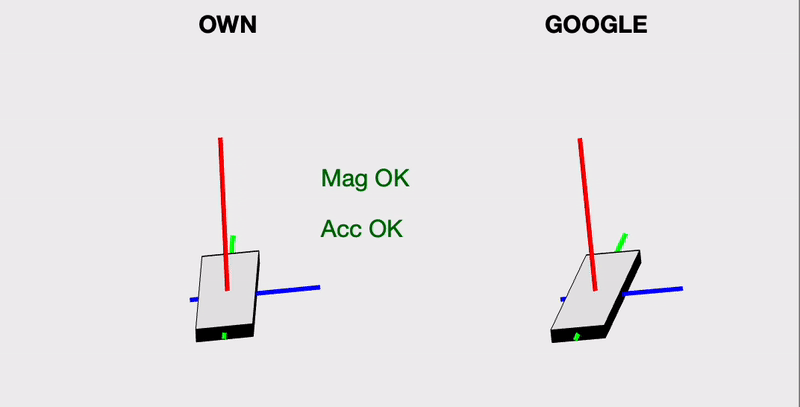
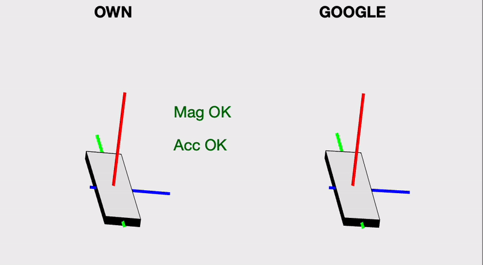
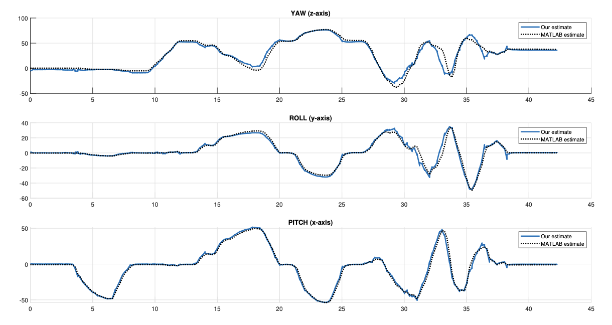

# SSY345 Sensor Fusion and Nonlinear Filtering

This repository contains the Assignments 1-4 for the course SSY345 Sensor Fusion and Nonlinear Filtering along with the final Project from Chalmers University of Technology. 

**Course year**: 2023

**By**: Nicholas Granlund

## Assignment 1:

Topics:
- Properties of **random variables** 
- **Gaussian variables**
- Transformation of random variables
- Nonlinear transformation
- **Conditional densities**
- **MMSE** and **MAP** estimators

## Assignment 2:

Topics:
- **Kalman filter**
- linear **state-space model**
- **Consistency**
- Tuning a Kalman filter
- **Fusing sensors** with different sampling rates
- **Motion model** selection

## Assignment 3:

Topics:
- **Nonlinear Kalman filtering**
- Extended Kalman filter (**EKF**)
- Unscented Kalman filter (**UKF**)
- Cubature Kalman filter (**CKF**)
- **Sigma-points**
- Tuning nonlinear filters
- Coordinated turn motion model

## Assignment 4:

Topics:
- **Smoothing**
- RTS smoother
- **Particle filters** for linear/gaussian systems
- **Particle filters** for nonlinear systems
- Trajectory estimation with / without particle resampling
- Bicycle tracking and positional estimate

## Final Project:

Topics:
- Orientation estimate of smartphone, iOS based
- Extended Kalman filter (**EKF**)
- Fusing accelerometer, gyroscope and magnetometer
- Choosing model based on input/output
- Using **quaternions** to represent orienatation
- Real-time orientation estimate

This repository also contains files developed by the group members which supports iOS devices. Please see filterTemplateiOS.m

The project was performed with the help of Louise Olsson

**Demonstration of EKF orientation estimate:**

**EKF accuracy compared to built-in filter:**

